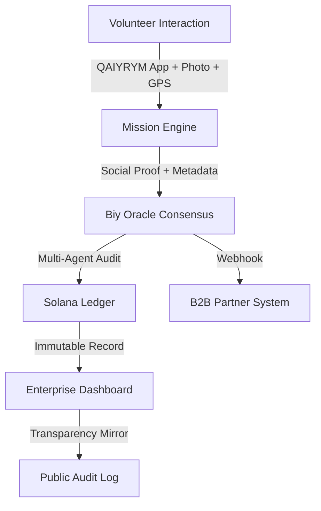

# 🪐 ProtoQol API: The Decentralized Integrity Engine

### **The Algorithm with a Conscience — Backend & API Layer**
*Built for the Solana Decentrathon 2026*

---

## 🛰️ Ecosystem Overview

ProtoQol is a dual-layered integrity infrastructure designed to reclaim **Amanat** (trust) in the digital age. It connects grassroots humanitarian actions with enterprise-grade accountability.

1. **QAIYRYM (B2C)**: A Telegram Mini App for volunteers. Users submit mission reports with photos, geolocation, and timestamps — and get rewarded in SOL + Soulbound Tokens.
2. **ProtoQol Engine (B2B)**: A Zero-Trust oracle network that anchors social integrity proofs directly onto the Solana ledger.

> **Note:** The project is submitted to the hackathon under the name **QAIYRYM**. ProtoQol is the Integrity Layer — the engine under the hood.

---

## 🧬 Core Technology

### 1. The Biy Oracle Consensus (Multi-Agent AI)

Traditional oracles only handle price data. The **Biy Oracle** uses a swarm of 4 specialized AI agents (Gemini 2.0 Flash) to reach consensus on real-world events ("Was the humanitarian aid actually delivered?").

| Agent | Role | What it checks |
|-------|------|----------------|
| ⚔️ **The Auditor** | Fact-checker | Multimodal photo analysis, object detection, geolocation cross-validation (`lat/lon` vs mission zone), timestamp freshness |
| 🔍 **The Skeptic** | Fraud detector | Stock photo patterns, AI-generated image artifacts (GAN fingerprints), recycled reports via SHA-256 hash deduplication |
| 🤝 **The Social Biy** | Impact evaluator | Assesses "Asar" (communal spirit), calculates weighted social impact score |
| ⚖️ **Master Biy** | Final judge | Aggregates all reports. Only 2/3 majority triggers `ADAL` on-chain settlement |

**Key properties:**
- **Neutrality**: Each agent audits independently with adversarial incentives (Skeptic vs Auditor)
- **Multimodal input**: Text + photos (base64 PNG) + geolocation (`lat`, `lon`) + timestamps
- **Integrity anchor**: SHA-256 hash of the raw AI response → immutable on Solana
- **Resilience**: 30s timeout + fallback to `REVIEW_NEEDED` (never fakes a positive verdict)

### 2. Anti-Fraud: How QAIYRYM Makes Cheating Impossible

Fraud prevention is **baked into every layer** of the protocol:

| Fraud Type | Detection Method |
|-----------|------------------|
| 📍 **Fake location** | Geolocation metadata (`lat/lon`) cross-validated against mission zone |
| 📷 **Stock photos** | Gemini Vision detects professional lighting, watermarks, and stock patterns |
| 🤖 **AI-generated images** | GAN artifact detection, unnatural texture analysis |
| ♻️ **Recycled reports** | SHA-256 hash of photo bytes compared against all previous submissions |
| ⏰ **Backdated reports** | Timestamps cross-checked against mission active periods |
| 💉 **Prompt injection** | The Skeptic agent specifically watches for LLM manipulation attempts |

```python
# Every verification request carries enriched metadata
meta = {"lat": 50.2839, "lon": 57.1670, "timestamp": "2026-04-05T10:30:00Z"}
ai_res = await ai_engine.analyze_deed(description, mission_info, meta=meta, photo_bytes=photo)
```

### 3. Solana Integrity Anchoring

We use Solana for high-speed settlement and immutable state:

- **PDA Escrow**: Funds are locked in Program Derived Accounts until AI consensus is reached
- **Oracle Voting**: 3 AI agents vote on-chain → auto-resolve at quorum (2/3 majority)
- **SBT Integrity Proofs**: Each verified deed mints a Soulbound Token (non-transferable NFT)
- **Zero-Trust**: No single entity (even us) can alter the audit history once it hits the ledger

**Program ID:** [`EdrjHLN9K9eogJ5Pui8WYJRAghdN4knAdAoDcZesAirc`](https://explorer.solana.com/address/EdrjHLN9K9eogJ5Pui8WYJRAghdN4knAdAoDcZesAirc?cluster=devnet)

### 4. Q-AI Compass

Proprietary navigation for social impact. Guides volunteers toward missions with the highest "Impact Density," calculated through real-time AI analysis of social needs and weighted by the `impact_weight` parameter per campaign.

---

## 🔌 API Endpoints

Authentication via `X-API-Key` header. Tiered plans: Free (10 credits) / Pro (1000) / Enterprise (unlimited).

| Endpoint | Method | Purpose |
|----------|--------|---------|
| `/api/v1/etch_deed` | `POST` | Enterprise-grade deed verification + background on-chain settlement |
| `/api/v1/verify_mission` | `POST` | Universal verification endpoint (JSON + multipart with photos) |
| `/api/v1/dashboard/stats` | `GET` | Client-specific impact metrics & recent activity feed |
| `/api/v1/gateway/missions` | `GET` | List all active campaigns (static + DB-managed) |
| `/api/v1/engine/health` | `GET` | Engine status, node list, Solana RPC state, and aggregate metrics |
| `/api/v1/sbt/check/{user_id}` | `GET` | Check SBT existence for a specific volunteer |
| `/audit/{integrity_hash}` | `GET` | Public Audit Mirror — cyberpunk-styled AI discussion transparency page |
| `/api/v1/inquiry` | `POST` | B2B lead capture for enterprise partnerships |
| `/api/v1/generate_mock_scenario` | `GET` | AI-powered generator for demo scenarios |

**Webhook support:** Register `webhook_url` per campaign → ProtoQol fires POST on every `CONSENSUS_REACHED` event.

---

## 🏛️ Architecture



---

## 🚀 Deployment

| Layer | Technology | Details |
|-------|-----------|---------|
| **Frontend** | HTML/CSS/JS + Telegram Web App API | Nomad Cyberpunk theme with glassmorphism |
| **Backend** | FastAPI + Multi-Agent Consensus Swarm | Unified Biy Council on Gemini 2.0 Flash |
| **Blockchain** | Solana Devnet + Anchor Framework | PDA escrow, oracle voting, SBT minting |
| **Persistence** | SQLite WAL | Deeds, clients, campaigns, credit quotas |
| **Live Hub** | [protoqol.vercel.app/hub.html](https://protoqol.vercel.app/hub.html) | Ecosystem showcase |

---

## 🏆 Project Impact

ProtoQol solves the "Trust Gap" in ESG reporting and humanitarian aid. By replacing subjective "reports" with objective "on-chain proofs," we enable a new era of verifiable social accountability.

**Real transactions on Solana Devnet:**
- [📝 View Deed Proposed TX ↗](https://solscan.io/tx/4DuZMAkH1FTueetgB4AExC5hLFnsPf7jTjJWYNRkVPfzcyqCukcohXpod3XncKJJrwFubsp1upAzHB3udqfxNdit?cluster=devnet)
- [🗳️ View AI Biy Oracle Vote TX ↗](https://solscan.io/tx/3atA1kXGLSE41M2V5QHzYfAaqPL9X3uP9Bgm6kjxfAxrqzxsuJ5WcGUPMtwfuPxwgoCXm9AYnvzfaMvXkNioYwZX?cluster=devnet)

---

*Developed by Alikhan Bakhtybay (Sovushka0290) for Decentrathon 2026.*
*Solo Founder • 17 years old • Aktobe, Kazakhstan 🇰🇿*
